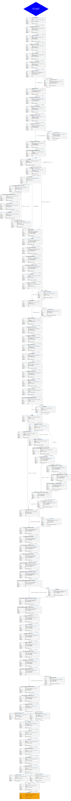

========
Overview
========

What is a3m?
============

a3m is a digital preservation tool that automates the creation of Archival
Information Packages (AIPs) which is one of the types of information packages
described in the `OAIS reference model`_.

Roadmap
=======

a3m is developed in the public but it has not been formally announced yet. The
amount of customer feedback that we have collected so far is low hence our
roadmap has not been set in stone, but the authors have plans.

* **Correctness.**
  A proof of concept was developed to demonstrate some of the design principles
  like integrability or simplicity. However, the arfifacts that a3m produces
  have not been thoughtfully verified yet and there are some known issues.

* **Operability.**
  Producing standalone executables and integrating with cloud-based
  environments. Dependency management.

* **Reference deployment architecture.**
  Producing a reference configuration showing how to run a a3m-based processing
  pipeline at scale using cloud services like container schedulers and
  distributed object storage.

Do you have other ideas? Please let us know!

Architecture
============

Written in Python, a3m borrows the processing engine of Archivematica and
the pieces of the workflow that relate to the creation of AIPs. As a result,
it inherits some of the benefits and flaws, but with a much smaller and
malleable codebase.

The main differentiator is the lack of service dependencies. a3m does not
depend on Gearman or external workers, MySQL, Elasticsearch or Nginx. a3m
provides its own API server based on the gRPC stack and all processing is
performed via system threads and spawned child processes. An embedded
database based on SQLite is used to store temporary processing state.

a3m is comprised of three main components. A workflow engine is responsible for
the processing while its management is made available to users via the gRPC API
which follows the client-server model.

.. mermaid::

   graph LR

     cli(gRPC client)-- operates --> srv(gRPC server)
     srv(gRPC server)-- controls --> we(Workflow engine)
     style we fill:#eff

In practice, these components can be operated in multiple ways.

Client-server mode
------------------

Using the **a3md** executable, users can set up an a3m server(s) locally or
made available over the network. It is a daemon typically set up with a system
processor manager such as Systemd or a container scheduler.

.. mermaid::

   graph LR

     cli(gRPC client)

     subgraph a3md
       srv(gRPC server)-- controls --> we(Workflow engine)
     end

     cli-- operates --> srv

Clients can be implemented using one of programming languages supported by
gRPC, e.g.: Go, C++, Java, Python, C# or Node.js are some examples.

.. _OAIS reference model: https://en.wikipedia.org/wiki/Open_Archival_Information_System

a3m provides its own CLI-based client via the **a3m** executable:

.. mermaid::

   graph LR

     subgraph a3m
       cli(gRPC client)
     end

     subgraph a3md
       srv(gRPC server)-- controls --> we(Workflow engine)
     end

     cli-- operates --> srv

Given a server available on ``172.26.0.1:7000``, this is how you
would run the client::

    a3m --address=172.26.0.1:7000 ~/Desktop/pictures

Standalone mode
---------------

The **a3m** executable is capable to run both the client and the server
simultaneously, hiding the topology details from the user. The outcome is a
command-line tool that can be executed for one-off tasks without extra
configuration steps.

.. mermaid::

   graph LR

     subgraph a3m
       cli(gRPC client)
       srv(gRPC server)
       we(Workflow engine)

       cli-- operates -->srv
       srv-- controls -->we
     end

In practice, the standalone mode is enabled when the ``--address`` flag is not
used::

    a3m ~/Desktop/pictures

Embedded mode
-------------

A design principle in a3m is *composability*. It wants to become a building
block for system integrators. Please read the :doc:`development kit usage
page<development>` to learn how to use our programming interfaces.

There are multiple use cases. For example, you may want to build an application
that connects to a message broker used to receive preservation requests and
publish the results. If you were writing this application using Python, our
programming interfaces could assit you in embedding a3m easily.

.. mermaid::

   graph TB

     subgraph Broker
       q1(SUB)
       q2(PUB)
     end

     subgraph Application
       int(Integration)
       a3m(a3m)
     end

     q1-- notifies -->int
     int-- uses -->a3m
     int-- publishes --> q2

     style a3m fill:#fff

You could also run a3m as a child process and control it via gRPC. An example
could be a desktop application that uses Electron - the core is going to be
written in Node.js, but nothing stops you from spawning a child process to run
a3m and control it via its API.

.. mermaid::

   graph TB

     subgraph Application
       ele(Electron)
       a3m(a3m)
       ele-- gRPC -->a3m
       style a3m fill:#fff
     end

Workflow
========

In a3m, the processing workflow is encoded using the same JSON-encoded format
used by Archivematica, defining all processing steps as a sequence of actions.
Workflows are best explored using `amflow
<https://github.com/artefactual-labs/amflow/>`_.

.. note::

   If you've used amflow before, you may find a3m's workflow much smaller and
   simpler. Unlike Archivematica, a3m does not make use of watched directories
   or chains and the process is very linear. The following image shows an SVG
   version of the workflow.

   The workflow graph below was built using `make workflow`.

